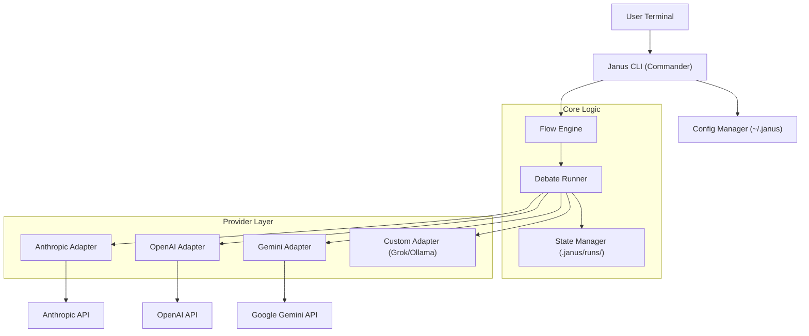

# Janus: Technical Specifications

## 1. System Architecture

## 1. System Architecture



```text
+---------------------+        +-------------------------+
|    User Terminal    | -----> |   Janus CLI (Commander) |
+---------------------+        +-----------+-------------+
                                           |
                                           v
                               +-----------+-------------+
                               |     Config Manager      |
                               |    (~/.janus/config)    |
                               +-----------+-------------+
                                           |
                                           v
       +-----------------------------------+-----------------------------------+
       |                           Flow Engine                                 |
       |  (Orchestrates the Debate Loop & Manages State in .janus/runs/)       |
       +-----------------------------------+-----------------------------------+
                                           |
                +--------------------------+---------------------------+
                |                          |                           |
      +---------v---------+      +---------v---------+       +---------v---------+
      | Anthropic Adapter |      |   OpenAI Adapter  |       |   Gemini Adapter  |
      +---------+---------+      +---------+---------+       +---------+---------+
                |                          |                           |
                v                          v                           v
      ( Claude 3.5 Sonnet )       ( GPT-4o / Codex )        ( Gemini 1.5 Pro )
```

## 2. Workflows

### 2.1 The Convergence Loop (Visualized)

This flow represents a 2-Round "Ideation" session.

```text
START: User Input (idea.md)
   |
   | [Round 1: Divergence]
   | "Here is an idea. Flesh it out into a full plan."
   | Sent to all models in parallel.
   |
   +---------------------------+---------------------------+
   |                           |                           |
   v                           v                           v
+--+----------+             +--+----------+             +--+----------+
|  CLAUDE     |             |  OPENAI     |             |  GEMINI     |
| (Creates    |             | (Creates    |             | (Creates    |
|  v1 file)   |             |  v1 file)   |             |  v1 file)   |
+--+----------+             +--+----------+             +--+----------+
   |   ^                       |   ^                       |   ^
   |   |                       |   |                       |   |
   |   |                       |   |                       |   |
   |   +----------+            |   +----------+            |   +----------+
   |              |            |              |            |              |
   | [Reads]      |            | [Reads]      |            | [Reads]      |
   | OpenAI.v1    |            | Claude.v1    |            | Claude.v1    |
   | Gemini.v1    |            | Gemini.v1    |            | OpenAI.v1    |
   |              |            |              |            |              |
   | [Round 2]    |            | [Round 2]    |            | [Round 2]    |
   | "Critique"   |            | "Critique"   |            | "Critique"   |
   v              |            v              |            v              |
+--+----------+   |         +--+----------+   |         +--+----------+   |
|  CLAUDE     |   |         |  OPENAI     |   |         |  GEMINI     |   |
| (Creates    |   |         | (Creates    |   |         | (Creates    |   |
|  v2 file)   | --+         |  v2 file)   | --+         |  v2 file)   | --+
+-------------+             +-------------+             +-------------+
```

### 2.2 Textual Walkthrough

**Phase 1: Divergence (The "Brainstorm")**
1.  **Input**: The system reads the user's `idea.md`.
2.  **Prompting**: It wraps this file in the **Round 1 Prompt** (defined in the Flow config).
3.  **Broadcasting**: It sends this identical prompt to all 3 providers simultaneously.
4.  **Output**: Three distinct files are saved: `claude.v1.md`, `openai.v1.md`, `gemini.v1.md`.

**Phase 2: Convergence (The "Peer Review")**
1.  **Context Assembly**:
    *   For Claude, the system loads `openai.v1.md` and `gemini.v1.md`.
    *   For OpenAI, it loads `claude.v1.md` and `gemini.v1.md`, etc.
2.  **Prompting**: It constructs the **Refinement Prompt**:
    *   "You are Claude. Here is your original plan (v1). Here are plans from your peers (OpenAI, Gemini). Critique their approaches, steal their best ideas, and write a superior V2."
3.  **Execution**: The models generate their improved versions.
4.  **Output**: `claude.v2.md`, `openai.v2.md`, `gemini.v2.md` are saved.

**Phase 3: Synthesis (Optional)**
1.  **Selection**: The user (or config) selects a "Judge" (e.g., Claude).
2.  **Prompting**: "Review these three V2 plans. Merge them into one final Master Plan."
3.  **Result**: `idea.final.md`.


### 2.2 Onboarding Path (`janus init`)

```text
[ Start ]
    |
    v
[ Check Existing Config? ] --(Yes)--> [ Validate Keys ] --(Valid)--> [ Ready ]
    |                                        |
  (No)                                   (Invalid)
    |                                        |
    v                                        v
[ Interactive Wizard ] <---------------------+
    |
    +---> "Select Providers to Enable" (Checkbox)
    |
    +---> "Enter API Key for Anthropic?" (Input/Skip)
    |
    +---> "Enter API Key for OpenAI?" (Input/Skip)
    |
    +---> "Enter API Key for Gemini?" (Input/Skip)
    |
    v
[ Write ~/.janus/config.yaml ]
    |
    v
[ Run Connectivity Test ] --(Success)--> [ Ready ]
                          --(Fail)--> [ Warn User & Save ]
```

### 2.3 Flow Definition Wizard (`janus new-flow`)

This interaction occurs when a user defines a new process (e.g., "Ideation").

```text
[ Start Wizard ]
    |
    v
"What do you want to call this flow?" (e.g., 'ideation')
    |
    v
"Enter the Round 1 Prompt" (The initial instruction context)
    |
    v
"How many rounds of refinement?" (Input Integer N)
    |
    v
"Enter the Round 2 Prompt" (The first critique/review instruction)
    |
    v
[ Decision: Is N > 2? ]
    |
    +--(No)----------------------------------------+
    |                                              |
    +--(Yes)--> "Use unique prompts for each round?" (Y/n)
                  |
                  +--(No)--> [ Use Round 2 Prompt for 3..N ]
                  |
                  +--(Yes)--> [ Loop i = 3 to N ]
                                |
                                v
                              "Enter input for Round {i}"
```

## 3. Use Cases

### 3.1 Happy Path: The "Ideation" Run
**Actor**: User (Product Manager)
**Goal**: Refine a vague feature request.
**Steps**:
1. User creates `feature.md` with 2 sentences.
2. User runs `janus run ideation feature.md`.
3. Janus prompts: "How many rounds?" (User enters `2`).
4. Janus displays spinner: "Round 1: Diverging...".
5. Files assume: `claude.v1.md`, `openai.v1.md`, `gemini.v1.md` created.
6. Janus displays: "Round 2: Converging...".
7. Janus feeds V1s to peers.
8. Files assume: `claude.v2.md`, etc. created.
9. **Success Condition**: User opens explorer and sees 6 generated files rooted in deep reasoning.

### 3.2 Happy Path: Code Audit
**Actor**: User (Developer)
**Goal**: Find security flaws in a file.
**Configuration**: Flow=`audit`, Lens=`security`.
**Steps**:
1. User runs `janus run audit src/auth.ts --lens security`.
2. **Lens Injection**: System prompt "You are a hostile security auditor" is prepended.
3. Models analyze the code with "Round 1 Prompt: Find vulnerabilities".
4. Models critique each other's findings in Round 2 ("Did Claude miss the XSS?").
5. **Success**: A hardened audit report.

## 4. Edge Cases & Handling

### 4.1 Partial Provider Failure
**Scenario**: OpenAI API is down (500 Error), but Claude and Gemini are up.
**Handling**:
- **Round 1**: Janus logs error for OpenAI. `openai.v1.md` is written as `[ERROR: Provider Failed]`.
- **Round 2**: Claude and Gemini proceed. They are told "OpenAI failed to report."
- **Result**: The show goes on with available intelligence (Graceful Degradation).

### 4.2 Rate Limiting (429)
**Scenario**: User hits Gemini Free Tier limit.
**Handling**:
- Adapter implements **Exponential Backoff**.
- Retries 3 times (1s, 2s, 4s).
- If still failing, treat as Partial Provider Failure (see 4.1).

### 4.3 Context Window Overflow
**Scenario**: The inputs (Peer reviews) are too large for the next model's context.
**Handling**:
- **Refinement Strategy**: "Summarization Pass".
- Before feeding `v1` to the peer, Janus automatically runs a fast "Summarize the key points" step to compress the context.
- (Minimum Viable Version): Truncate or Error out. We will aim for **Error with helpful message** in V1.

### 4.4 Auth Token Expiry
**Scenario**: `~/.claude/` token is stale.
**Handling**:
- First request fails with 401.
- CLI pauses execution.
- Prompt User: "Anthropic Auth failed. Please refresh token or press Ctrl+C to skip."
